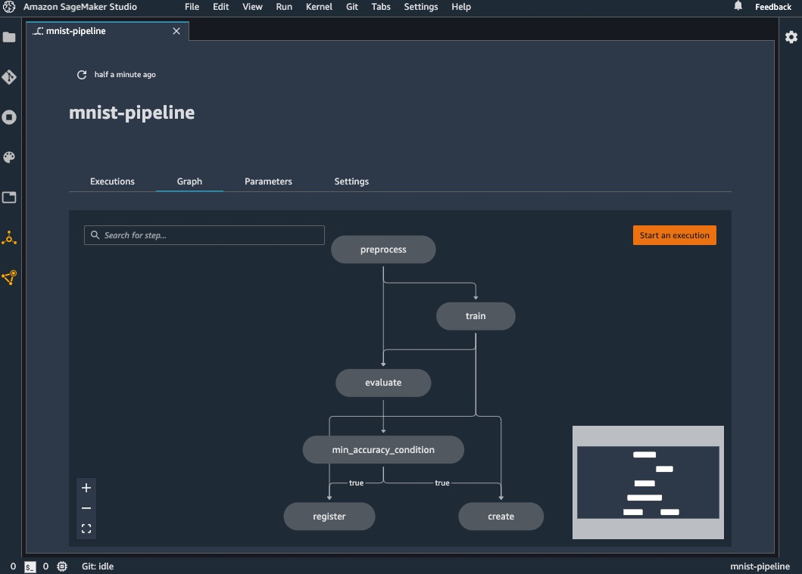
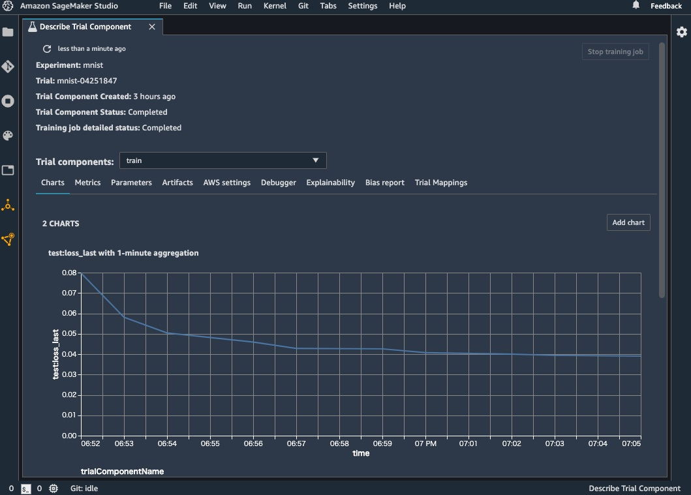
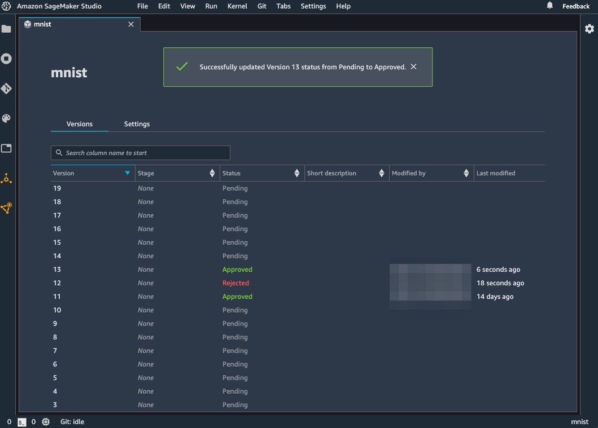
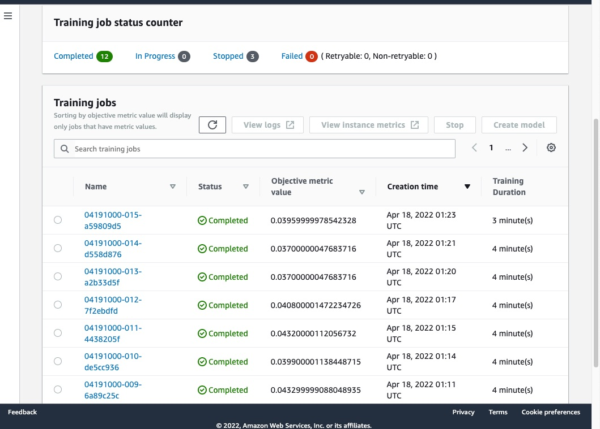

# how-to-construct-mlops-with-amazon-sagemaker

Amazon SageMaker で MLOps (前処理・学習・評価・推論、および、実験・モデル・ワークフローの管理) を実現するミニマムなコードサンプルです。





## Features

- ゼロからコンテナイメージを作成してます (Bring Your Own Container: BYOC)
- MNIST と PyTorch を用いており、画像処理タスクでの SageMaker の活用を概観できます
- SageMaker で広く使われている以下の機能をカバーしています
  - Processing Jobs (前処理・評価)
  - Training Jobs (学習)
  - Hyperparameter Tuning Jobs (ハイパパラメータチューニング)
  - Model Registry (モデル管理)
  - Endpoints (リアルタイム推論)
  - Batch Transform Jobs (バッチ推論)
  - Experiments (実験管理)
  - Pipelines (パイプラインの作成・実行)

## Usage

### Requirement

本レポジトリで使用する、以下の AWS リソースを作成してください。

- S3 Bucket
  - 前処理・学習・評価などの結果ファイル (アーティファクト) の保持に使用
  - デフォルトでは sagemaker-{REGION}-{ACCOUNT_ID} のバケットが使われます
- ECR
  - 前処理・学習・評価・推論などの処理を実装するコンテナイメージの保持に使用
  - 作成後、環境変数 (IMAGE_NAME と IMAGE_URI) をセットしてください
- IAM Role
  - AWS アカウントへのアクセス全般 (ECR や SageMaker の操作) に使用
  - AmazonSageMakerFullAccess ポリシー、および、上で作成した S3 Bucket と ECR への権限を付与したロールを作成してください
- (Option) SageMaker Studio
  - Pipelines や Experiments などを Web UI で参照できます

開発環境には以下をインストールしてください。なお簡単化のため、コンテナの開発・デプロイと SageMaker への処理のリクエストは、同一の計算機から行う前提です。

- [Python 3.9](https://www.python.org/downloads/)
- [Poetry](https://python-poetry.org/)
- [AWS CLI](https://aws.amazon.com/jp/cli/)
- (Option) [direnv](https://github.com/direnv/direnv)

AWS アカウントのプロファイルや認証情報をセットしてください。

```
$ aws configure list
```

### Clone

```
$ git clone https://github.com/ohke/amazon-sagemaker-mnist-example.git
$ cd amazon-sagemaker-mnist-example
```

### Edit environment variables

```
$ cp .env.example .env
$ vi .env

# If you use direnv...
$ direnv allow
```

### Deploy container image

```
$ cd container
$ make build-and-push
```

### Execute SageMaker script

```
$ cd sagemaker

$ env $(cat ../.env) poetry shell
$ python src/hoge.py ...

# If you use direnv...
$ poetry run src/hoge.py ...
```

## Code structure

以下 2 つのディレクトリからなります。

- container
  - コンテナの実装
  - 前処理・学習・推論のコードはこちらに集約されます
  - ビルドされたコンテナイメージを ECR にプッシュすることで、SageMaker から実行できるようにします
- sagemaker
  - SageMaker の実装

### container

```
container
├── Makefile -> 開発・デプロイ用のタスクランナー
├── Dockerfile
├── docker-compose.yml
├── build_and_push.sh -> デプロイスクリプト
├── poetry.lock
├── pyproject.toml
├── data -> ローカルコンテナの /opt/ml にマウントされる (開発用)
└── src
    ├── evaluate.py -> accuracyで評価
    ├── inference.py -> 推論API (Endpoint, Batch Transform)
    ├── model.py -> ネットワーク実装
    ├── preprocess.py -> MNISTデータのダウンロード
    ├── serve.py -> 推論コード (コンテナイメージ内では /opt/ml/program/serve へmvされる)
    ├── train.py -> 学習コード (コンテナイメージ内では /opt/ml/program/train へmvされる)
    ├── nginx.conf -> 推論APIのnginxの設定
    └── wsgi.py -> 推論APIのWSGIの設定
```

#### develop

```
$ docker-compose run dev
```

#### deploy

```
$ make build-and-push
```

### sagemaker

```
sagemaker
├── Makefile -> 開発用のタスクランナー
├── poetry.lock
├── pyproject.toml
└── src
    ├── preprocess.py -> Processing Jobs
    ├── train.py -> Training Jobs
    ├── hyperparameter_tuning.py -> Hyperparameter Tuning Jobs
    ├── evaluate.py -> Processing Jobs
    ├── register_model.py -> Model Registry
    ├── delete_endpoint.py -> Endpoints
    ├── deploy_endpoint.py -> Endpoints
    ├── run_batch_transform.py -> Batch Transforms
    ├── pipeline.py -> Pipelines
    └── utility.py -> Experiments
```

## References

- https://docs.aws.amazon.com/sagemaker/
- https://github.com/aws/amazon-sagemaker-examples
- [O'Reilly Japan - 実践 AWS データサイエンス](https://www.oreilly.co.jp/books/9784873119687/)
